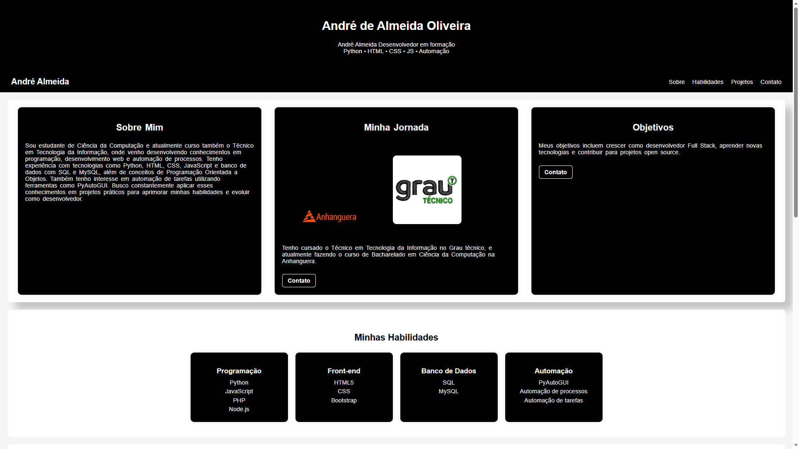

Meu Portfólio
## Tecnologias

Este é meu site de portfólio pessoal desenvolvido com, 

  
Nele apresento minhas habilidades, alguns projetos e formas de contato.

 Sobre

Sou estudante de Ciência da Computação e atualmente também curso o Técnico em Tecnologia da Informação.  
Neste site apresento um pouco da minha trajetória, competências e projetos desenvolvidos durante meus estudos.

 Tecnologias utilizadas

- HTML
- CSS
- Bootstrap
- Python (nos projetos apresentados)

 Projetos

Entre os projetos apresentados está um automatizador de tarefas desenvolvido em Python utilizando a biblioteca PyAutoGUI, capaz de executar ações repetitivas no computador como clicar em botões e preencher formulários.

 Acesse o site

Você pode acessar o portfólio online aqui:

https://andrealmeidao.github.io/Meu-Portfolio/

 Contato

- LinkedIn
- GitHub
